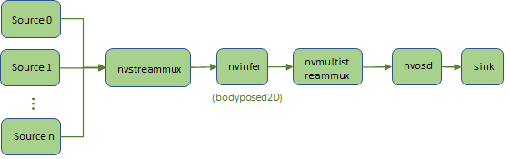

## Description
The bodypose2D sample application uses bodypose2D model to detect human body parts coordinates. The application can output the 18 body parts:
- nose
- neck
- right shoulder
- right elbow
- right hand
- left shoulder
- left elbow
- left hand
- right hip
- right knee
- right foot
- left hip
- left knee
- left foot
- right eye
- left eye
- right ear 
- left ear

## Model

The bodypose2D backbone and pre-trained model are provided by TAO [bodypose 2D estimation](https://ngc.nvidia.com/catalog/models/nvidia:tao:bodyposenet). 
  
There is blog to introduce how to train and optimize the bodypose 2D estimation model:

https://developer.nvidia.com/blog/training-optimizing-2d-pose-estimation-model-with-tao-toolkit-part-1  

## Prerequisition

* DeepStream SDK 6.2 GA and above

## Application Pipeline
The application pipeline graph



## Build And Run
The application can be build and run seperately.

```
cd apps/tao_others/deepstream-bodypose2d-app
```

Build the applications and run to inference one picture.
```
make
export LD_LIBRARY_PATH=$LD_LIBRARY_PATH:/opt/nvidia/deepstream/deepstream/lib/cvcore_libs
./deepstream-bodypose2d-app 2 ../../../configs/bodypose2d_tao/sample_bodypose2d_model_config.txt 0 0 file:///usr/data/bodypose2d_test.png ./body2dout
```

## Post_processing Parameters
The bodypose2D sample application can config post-processing parameters with configuration file. There is a sample of the configuration file "sample_postprocessing_config.txt".
The definition and explanation of the parameters are in following table:

Post-process parameters
    
|Parameter | Type | Description / Instructions| Default |
|----------|------|---------------------------|---------|
|featUpsamplingFactor|int|Upsampling factor to use for heatmap to match with the part affinity maps output. For instance, here heatmap output is 1/8th of the network input, where as part affinity map is 1/2th of the network input, so the upsampling factor is 4|4|
|nmsWindowSize|int|Size of the window (kernel size) to be used for Non-max suppression.|7|
|threshHeat|float|Threshold value to use for filtering peaks (heatmap) after Non-max suppression|0.05|
|threshVectorScore|float|Threshold value to use for suppressing connections in part affinity fields|0.05|
|threshVectorCnt1|int|Threshold value for number of qualified points out of all the sampled points along each connection. By default, 10 points are sampled along each connection to verify if it qualifies as a connection candidate.|8|
|threshPartCnt|int|Minimum number of parts needed to qualify as a successful detection.|4|
|threshHumanScore|float|Minimum overall confidence score needed to qualify as a successful detection|0.4|
|numJoints|int|Number of joints which can be detected by the network|18|
|jointEdges|uint32_t pair vector|Skeleton edge mapping using zero indexed joint indices. Example: If joint index 0 is nose and index 4 is left ear, {0, 4} represents an edge between nose tip and left ear, Joint edges need to be provided in the order of paf map order. i.e Edge 0 corresponds to channel 0, 1 of paf Map, Edge index 1 corresponds to channel 2, 3 of paf map|

Please make sure the model related parameters in postprocessing config file match the parameters in nvinfer config file. E.G. the "batchSize" value in postprocessing config file should be the same as the "batch-size" value in nvinfer config file.

** The sample application can supports up to 18 joints models by default. The ‘BODYPART_TOTAL_NUM’ macro in ds_bodypose2d_meta.h should be changed to support > 18 joints models **

## Model parameters

Please refer to /opt/nvidia/deepstream/deepstream/sources/includes/cvcore_headers/cv/core/Model.h

The model parameters can be modified according to the actual model.
