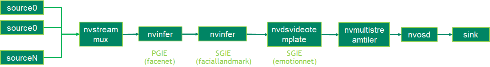

## Description
The emotion deepstream sample application identify human emotion based on the facial landmarks. Current sample application can identify five emotions as neutral, happy, surprise, squint, disgust and scream.

The TAO3.0 pretrained models used in the sample application are:
* [Facial Landmarks Estimation](https://ngc.nvidia.com/catalog/models/nvidia:tao:fpenet)
* [FaceNet](https://ngc.nvidia.com/catalog/models/nvidia:tao:facenet)
* [EmotionNet](https://ngc.nvidia.com/catalog/models/nvidia:tao:emotionnet)

## Prerequisition

* DeepStream SDK 6.0 and above

  Current DeepStream 6.0 EA version is available in https://developer.nvidia.com/deepstream-sdk-6.0-members-page for specific users.

## Application Pipeline
The application pipeline graph



## Build And Run
The application can be build and run seperately.

For Jetson platform:

Copy the gst-nvdsvideotemplate plugin source code from DeepStream for servers and workstations package and copy from the following folder:

/opt/nvidia/deepstream/deepstream/sources/gst-plugins/gst-nvdsvideotemplate

```
    cd /opt/nvidia/deepstream/deepstream/sources/gst-plugins/gst-nvdsvideotemplate
    make
    cp libnvdsgst_videotemplate.so /opt/nvidia/deepstream/deepstream/lib/gst-plugins/
    rm -rf ~/.cache/gstreamer-1.0/
```
And then back to the tao applications project directory
```
export CUDA_VER=10.2
```

For dGPU
```
export CUDA_VER=11.1
```
Build the nvvideotemplate library and the application and run to inference one picture.
```
cd apps/tao_others/deepstream-emotion-app/emotion_impl
make
cd ../
make
export LD_LIBRARY_PATH=$LD_LIBRARY_PATH:/opt/nvidia/deepstream/deepstream/lib/cvcore_libs
./deepstream-emotion-app 2 file:///usr/data/faciallandmarks_test.jpg ./landmarks
```
