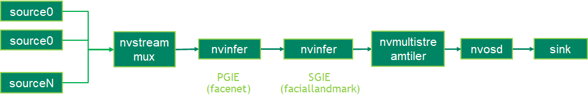

## Description
The facial landmarks estimation deepstream sample application identify landmarks in human face with face detection model and facial landmarks estimation model.
With the TAO 3.0 pretrained facial landmarks estimation model, the application can idetify 80 landmarks in one human face.

The TAO 3.0 pretrained models used in this sample application:
* [Facial Landmark Estimation](https://ngc.nvidia.com/catalog/models/nvidia:tao:fpenet).
* [FaceNet](https://ngc.nvidia.com/catalog/models/nvidia:tao:facenet)

## Prerequisition

* DeepStream SDK 6.0 GA and above

## Application Pipeline
The application pipeline graph



## Build And Run
The application can be build and run seperately.

```
cd apps/tao_others/deepstream-faciallandmark-app
```

For Jetson platform
```
export CUDA_VER=10.2
```

For dGPU
```
export CUDA_VER=11.4
```

Build the applications and run to inference one picture.
```
make
export LD_LIBRARY_PATH=$LD_LIBRARY_PATH:/opt/nvidia/deepstream/deepstream/lib/cvcore_libs
./deepstream-faciallandmark-app 2 ../../../configs/facial_tao/sample_faciallandmarks_config.txt file:///usr/data/faciallandmarks_test.jpg ./landmarks
```

## Models with different landmarks numbers
This sample application can support models with different landmark numbers. The actual landmark number should be configured in the postprocessing config file and the faciallandmark model config file. By default, it can support landmark number no larger than 200. If the model can output larger than 200 landmarks, Please modify the 'FACEMARK_TOTAL_NUM' macro value in ds_facialmark_meta.h according to the model.

The sample of the postprocessing config file: configs/facial_tao/sample_faciallandmarks_config.txt
The sample of faciallandmark model config file: configs/facial_tao/faciallandmark_sgie_config.txt
