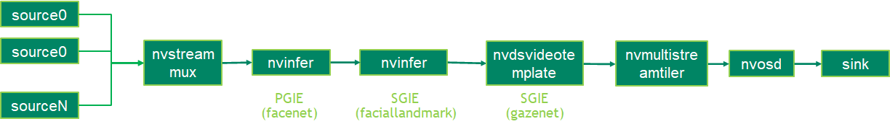

## Description
The GazeNet deepstream sample application recognizes a person's eye gaze point of regard (X, Y, Z) and gaze vector (theta and phi). The eye gaze vector can also be derived from eye position and eye gaze points of regard. The input of the GazeNet should be the human face and the faciallandmarks.

The TAO 3.0 pretrained models used in this sample application:

* [Facial Landmark Estimation](https://ngc.nvidia.com/catalog/models/nvidia:tao:fpenet).
* [FaceNet](https://ngc.nvidia.com/catalog/models/nvidia:tao:facenet)
* [GazeNet](https://ngc.nvidia.com/catalog/models/nvidia:tao:gazenet)

## Prerequisition

* DeepStream SDK 6.0 GA and above

* gst-nvdsvideotemplate plugin

  Since the GazeNet is a multi-input and multi-branch network and it depends on the facial landmark estimation model output which is not the standard deepstream object meta, the gst-nvinfer plugin can not support GazeNet inference.

  The gst-nvdsvideotemplate plugin is used in this sample to do the GazeNet inference. The libnvds_gazeinfer.so is the customized library for gst-nvdsvideotemplate to infer the batched iamges with the Nvidia proprietary inference library.

## Application Pipeline
The application pipeline graph



## Build And Run
The application can be build and run seperately.
For Jetson platform

Copy the gst-nvdsvideotemplate plugin source code from DeepStream for servers and workstations package and copy from the following folder:

/opt/nvidia/deepstream/deepstream/sources/gst-plugins/gst-nvdsvideotemplate

```
    export CUDA_VER=10.2
    cd /opt/nvidia/deepstream/deepstream/sources/gst-plugins/gst-nvdsvideotemplate
    make
    cp libnvdsgst_videotemplate.so /opt/nvidia/deepstream/deepstream/lib/gst-plugins/
    rm -rf ~/.cache/gstreamer-1.0/
```

For dGPU
```
export CUDA_VER=11.4
```

Build the applications and run to inference one picture.
```
cd apps/tao_others/deepstream-gaze-app/gazeinfer_impl
make
cd ../
make
export LD_LIBRARY_PATH=$LD_LIBRARY_PATH:/opt/nvidia/deepstream/deepstream/lib/cvcore_libs
./deepstream-gaze-app 2 ../../../configs/facial_tao/sample_faciallandmarks_config.txt file:///usr/data/faciallandmarks_test.jpg ./gazenet
```

## Known Issue
The GazeNet is a multiple input layers model. DeepStream can generate engine from such models but the implementation of buffer allocation has some problems. So if running the GazeNet sample application without engine, it will fail with core dump for the first time running. The engine will be generated after the first time running. When running the applications again, it will work.

Another workaround is to generate the engines outside the applications. The 'download_models.sh' script will download the GazeNet model. Please refer to the TAO tao-converter tool document: https://developer.nvidia.com/tao-toolkit-get-started
