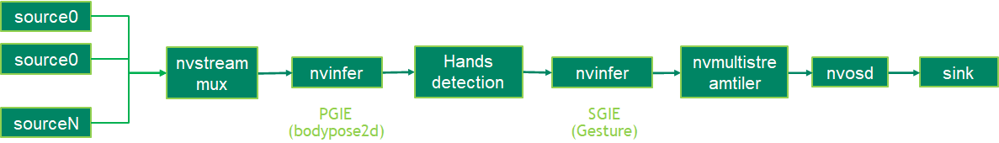

## Description
The gesture sample application uses the GestureNet model to the gesture of the hands which is identified by BodyPose model. 

## Model

The TAO 3.0 [GestureNet](https://docs.nvidia.com/tao/tao-toolkit/text/purpose_built_models/gesturenet.html) model is available in https://ngc.nvidia.com/catalog/models/nvidia:tao:gesturenet
The bodypose2D backbone is provided by TAO 3.0 [bodypose 2D estimation](https://ngc.nvidia.com/catalog/models/nvidia:tao:bodyposenet). 
  
There is blog to introduce how to train and optimize the bodypose 2D estimation model:
https://developer.nvidia.com/blog/training-optimizing-2d-pose-estimation-model-with-tao-toolkit-part-1

## Prerequisition

* DeepStream SDK 6.0 GA and above

## Application Pipeline
The application pipeline graph



## Build And Run
The application can be build and run seperately.

```
cd apps/tao_others/deepstream-gesture-app
export CUDA_VER=cuda version in the device
```

Build the applications and run to inference one picture.
```
make
export LD_LIBRARY_PATH=$LD_LIBRARY_PATH:/opt/nvidia/deepstream/deepstream/lib/cvcore_libs
./deepstream-gesture-app 2 ../../../configs/bodypose2d_tao/sample_bodypose2d_model_config.txt file:///usr/data/bodypose2d_test.png ./gesture
```
