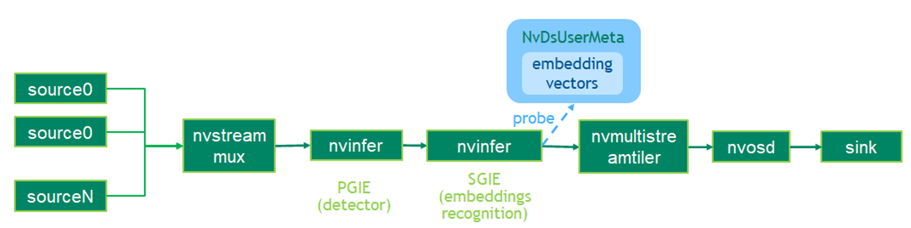

## Description
The MDX perception sample application drives two Deepstream pipelines, i.e. retail 
item recognition and people ReID. Retail item recognition pipeline detects retail 
items from a video and extracts the embedding vector out of every detection bounding box. 
The embedding vector can form a query to a database of embedding vectors and find
the closest match.
People ReID detects people from a video and extracts the embedding vector out of 
every detection bounding box. The pipelines have a primary GIE module detecting
the objects of interest from a video frame. The secondary GIE module extracts an
embedding vector from the primary GIE result.

The TAO 4.0 pretrained models used in this sample application:

* [Retail Object Detection Binary](https://catalog.ngc.nvidia.com/orgs/nvidia/teams/tao/models/retail_object_detection)
* [Retail Object Recognition](https://catalog.ngc.nvidia.com/orgs/nvidia/teams/tao/models/retail_object_recognition)
* [ReIdentificationNet Model](https://catalog.ngc.nvidia.com/orgs/nvidia/teams/tao/models/reidentificationnet)
* [PeopleNet Transformer Model](https://catalog.ngc.nvidia.com/orgs/nvidia/teams/tao/models/peoplenet_transformer)

## Prerequisition

* DeepStream SDK 6.2 GA and above

* NvDsInferParseCustomDDETRTAO
The custom post-processing plugin for Deformable DETR. The source code of tis plugin 
is included in `post_processor/nvdsinfer_custombboxparser_tao.cpp`.

* NvDsInferParseCustomEfficientDetTAO
The custom post-processing plugin for EfficientDet architecture. The source code 
of tis plugin is included in `post_processor/nvdsinfer_custombboxparser_tao.cpp`.

## Application Pipeline
The application pipeline graph



## Build And Run
The application can be build and run seperately. Download the pre-trained models if haven't.
```
export DS_TAO_APPS_HOME=<path to this repo>
cd $DS_TAO_APPS_HOME
download_models.sh
```

Build the applications and run to inference one picture.
```
cd $DS_TAO_APPS_HOME/apps/tao_others/deepstream-mdx-perception-app
make
./deepstream-mdx-perception-app  -c ../../../configs/app/peoplenet_reidentification.yml -m 2 --tiledtext
./deepstream-mdx-perception-app  -c ../../../configs/app/retail_object_detection_recognition.yml -m 3 --tiledtext
```

Uses can optionally modify `configs/app/retail_object_detection_recognition.yml` to enable sink2 which allows us to send metadata over Kafka, it can be modified to send metadata to any other broker such as Redis/Azure etc.., that DeepStream supports. By making use of a simple consumer script such as the one below 

```
# Contents of consumer.py
#!/usr/bin/python
import time
from kafka import KafkaConsumer
from json import loads
import uuid

consumer = KafkaConsumer(
    'test',
    bootstrap_servers='127.0.0.1:9092',
    auto_offset_reset='latest',
    enable_auto_commit=True,
    group_id=str(uuid.uuid1()),
    value_deserializer=lambda x: loads(x.decode('utf-8'))
)

# do a dummy poll to retrieve some message
consumer.poll()

# go to end of the stream
consumer.seek_to_end()

for event in consumer:
    event_data = event.value
    print(event_data)
```

The above script requries user to have a running Kafka broker. Here is a sample way on starting a kafka server using docker compose. Please refer to https://kafka.apache.org/quickstart for more details/options on using Kafka.

```
# docker-compose.yml
version: "3"
services:
  zookeeper:
    image: confluentinc/cp-zookeeper:5.4.3
    environment:
      ZOOKEEPER_CLIENT_PORT: 2181
      ZOOKEEPER_TICK_TIME: 2000

  kafka:
    image: confluentinc/cp-kafka:5.4.3
    depends_on:
      - zookeeper
    ports:
     - 9092:9092
    environment:
      KAFKA_BROKER_ID: 0
      KAFKA_LOG_DIRS: /kafka/logs
      KAFKA_ZOOKEEPER_CONNECT: zookeeper:2181
      KAFKA_LISTENER_SECURITY_PROTOCOL_MAP: PLAINTEXT:PLAINTEXT,PLAINTEXT_HOST:PLAINTEXT
      KAFKA_INTER_BROKER_LISTENER_NAME: PLAINTEXT
      KAFKA_ADVERTISED_LISTENERS: PLAINTEXT://kafka:29092,PLAINTEXT_HOST://127.0.0.1:9092
      KAFKA_AUTO_CREATE_TOPICS_ENABLE: "true"
      KAFKA_OFFSETS_TOPIC_REPLICATION_FACTOR: 1
      KAFKA_TRANSACTION_STATE_LOG_MIN_ISR: 1
      KAFKA_TRANSACTION_STATE_LOG_REPLICATION_FACTOR: 1
      KAFKA_GROUP_INITIAL_REBALANCE_DELAY_MS: 100
      KAFKA_CONFLUENT_LICENSE_TOPIC_REPLICATION_FACTOR: 1
      KAFKA_CONFLUENT_BALANCER_TOPIC_REPLICATION_FACTOR: 1
      CONFLUENT_METRICS_REPORTER_BOOTSTRAP_SERVERS: kafka:29092
      CONFLUENT_METRICS_REPORTER_TOPIC_REPLICAS: 1
      CONFLUENT_METRICS_ENABLE: 'true'
      CONFLUENT_SUPPORT_CUSTOMER_ID: 'anonymous'
```

User can start the kafka server with the following command 

```
docker-compose up -d 
```

User can run the script on a separate terminal with the kafka broker running the following way (by default the ds app is configured to publish metadata to kafka running at port 9092)
```
python3 consumer.py 

# Sample output metadata that is being sent from the DS pipeline (when sink2 is enabled) for the retail_object_detection_recognition_pipeline with PTM v2.0

{'version': '4.0', 'id': '367', '@timestamp': '1970-01-01T00:00:00.000Z', 'sensorId': 'stream1', 'objects': ['2|469.249|229.068|1183.21|523.846|Product|#|lipton_noodle_soup|||0.90813|#|embedding|-0.0956719,....,0.434932|']}\

```