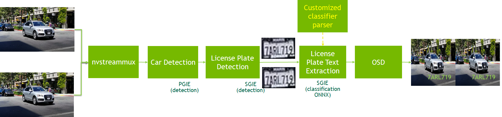

# Sample For Car License Recognization
 - [Description](#description)
 - [Performance](#performance)
 - [Prerequisition](#prerequisition)
 - [Download](#download)
 - [Prepare Triton Server](#prepare-triton-server)
 - [Build and Run](#build-and-run)
 - [Notice](#notice)

---

## Description
This sample is to show how to use graded models for detection and classification with DeepStream SDK version not less than 5.0.1. The models in this sample are all TAO3.0 models.

`PGIE(car detection) -> SGIE(car license plate detection) -> SGIE(car license plate recognization)`



This pipeline is based on three TAO models below

* Car detection model https://ngc.nvidia.com/catalog/models/nvidia:tao:trafficcamnet
* LPD (car license plate detection) model https://ngc.nvidia.com/catalog/models/nvidia:tao:lpdnet
* LPR (car license plate recognization/text extraction) model https://ngc.nvidia.com/catalog/models/nvidia:tao:lprnet

More details for TAO3.0 LPD and LPR models and TAO training, please refer to [TAO document](https://docs.nvidia.com/tao/tao-toolkit/text/overview.html).

## Performance
Below table shows the end-to-end performance of processing 1080p videos with this sample application.

| Device    | Number of streams | Batch Size | Total FPS |
|-----------| ----------------- | -----------|-----------|
|Jetson Nano|     1             |     1      | 9.2       |
|Jetson NX  |     3             |     3      | 80.31     |
|Jetson Xavier |  5             |     5      | 146.43    |
|Jetson Orin|     5             |     5      | 341.65    |
|T4         |     14            |     14     | 447.15    |

## Prerequisition

* [DeepStream SDK 6.0 or above](https://developer.nvidia.com/deepstream-getting-started)

  Make sure deepstream-test1 sample can run successful to verify your DeepStream installation

* [tao-converter](https://catalog.ngc.nvidia.com/orgs/nvidia/teams/tao/resources/tao-converter/version)

  Download x86 or Jetson tao-converter which is compatible to your platform from the links in https://catalog.ngc.nvidia.com/orgs/nvidia/teams/tao/resources/tao-converter/version.
* [Triton Inference Server](https://developer.nvidia.com/nvidia-triton-inference-server)
 
  The LPR sample application can work as Triton client on x86 platforms.

## Download

1. Download Project with SSH or HTTPS

```shell
    # SSH
    git clone git@github.com:NVIDIA-AI-IOT/deepstream_tao_apps.git
    # or HTTPS
    git clone https://github.com/NVIDIA-AI-IOT/deepstream_tao_apps.git
```

2. Prepare Models

All models can be downloaded with the following commands:

```shell
    cd deepstream_tao_apps/
    ./download_models.sh
```

## Prepare Triton Server
From DeepStream 6.1, LPR sample application supports three inferencing modes:
* gst-nvinfer inferencing based on TensorRT
* gst-nvinferserver inferencing as Triton CAPI client(only for x86)
* gst-nvinferserver inferencing as Triton gRPC client(only for x86)

The following instructions are only needed for the LPR sample application working with gst-nvinferserver inferencing on x86 platforms as the Triton client. For LPR sample application works with nvinfer mode, please go to [Build and Run](#build-and-run) part directly.

The Triton Inference Server libraries are required to be installed if the DeepStream LPR sample application should work as the Triton client, the Triton client [document](https://github.com/triton-inference-server/client) instructs how to install the necessary libraries. A easier way is to run DeepStream application in the [DeepStream Triton container](https://catalog.ngc.nvidia.com/orgs/nvidia/containers/deepstream).

* Setting up Triton Inference Server for native cAPI inferencing, please refer to [triton_server.md](https://github.com/NVIDIA-AI-IOT/deepstream_tao_apps/blob/master/triton_server.md).

* Setting up Triton Inference Server for gRPC inferencing, please refer to [triton_server_grpc.md](https://github.com/NVIDIA-AI-IOT/deepstream_tao_apps/blob/master/triton_server_grpc.md). 

## Build and Run

```shell
    # Build
    cd apps/tao_others/deepstream_lpr_app
    make
```

A sample of US car plate recognition:

```shell
    cp dict_us.txt dict.txt
    # nvinfer is used by default, please modify the configuration file 
    # for nvinferserver capi/nvinferserver grpc
    ./deepstream-lpr-app ../../../configs/app/lpr_app_us_config.yml
```

A sample of Chinese car plate recognition:

```shell
    cp dict_ch.txt dict.txt
    # nvinfer is used by default, please modify the configuration file 
    # for nvinferserver capi/nvinferserver grpc
    ./deepstream-lpr-app ../../../configs/app/lpr_app_ch_config.yml
```

## Notice
1. This sample application only support mp4 files which contain H264 videos as input files.
2. For Chinese plate recognition, please make sure the OS supports Chinese language.
3. The second argument of deepstream-lpr-app should be 2(fakesink) for performance test.
4. The trafficcamnet and LPD models are all INT8 models, the LPR model is FP16 model.
5. There is a bug for Triton gprc mode: the first two character can't be recognized.
6. For some yolo models, some layers of the models should use FP32 precision. This is a network characteristics that the accuracy drops rapidly when maximum layers are run in INT8 precision. Please refer the [layer-device-precision](https://docs.nvidia.com/metropolis/deepstream/dev-guide/text/DS_plugin_gst-nvinfer.html) for more details.
7. For Chinese plate recognition, please make sure the Chinese language support is in the OS. `Take Ubuntu as an example :`

 - Install Chinese Language package . 
   ```bash
   sudo apt-get install language-pack-zh-hans
   ```

 - Set the Chinese language enviroment
   ```bash
   export LANG=zh_CN.UTF-8
   export LANGUAGE="zh_CN:zh:en_US:en"
   ```
