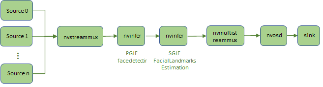

## Description
The facial landmarks estimation deepstream sample application identify landmarks in human face with face detection model and facial landmarks estimation model.
With the TLT 3.0 pretrained facial landmarks estimation model, the application can idetify 80 landmarks in one human face.

The TLT 3.0 pretrained models used in this sample application:
* [Facial Landmark Estimation](https://ngc.nvidia.com/catalog/models/nvidia:tlt_fpenet).
* [FaceDetectIR](https://ngc.nvidia.com/catalog/models/nvidia:tlt_facedetectir)

## Prerequisition

* DeepStream SDK 6.0 and above
  Current DeepStream 6.0 EA version is available in https://developer.nvidia.com/deepstream-sdk-6.0-members-page for specific users.

## Application Pipeline
The application pipeline graph



## Build And Run
The application can be build and run seperately.

```
cd apps/tlt_others/deepstream-faciallandmark-app
```

For Jetson platform
```
export CUDA_VER=10.2
```

For dGPU
```
export CUDA_VER=11.1
```

Build the applications and run to inference one picture.
```
make
export LD_LIBRARY_PATH=$LD_LIBRARY_PATH:/opt/nvidia/deepstream/deepstream/lib/cvcore_libs
./deepstream-faciallandmark-app 2 file:///usr/data/faciallandmarks_test.jpg ./landmarks
```

##
